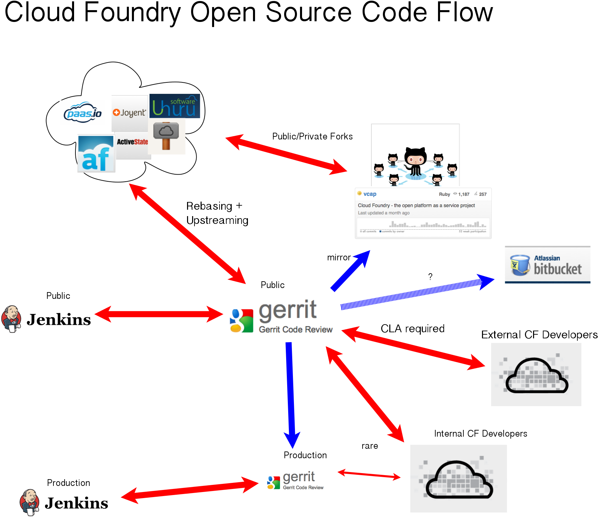

\thispagestyle{empty}
\changepage{}{}{}{-1.5cm}{}{2cm}{}{}{}
\

\clearpage
\changepage{}{}{}{1.5cm}{}{-2cm}{}{}{}

## About This Book

### License

The Little Cloud Foundry Book book is licensed under the
Attribution-NonCommercial-Share-Alike 3.0 Unported license. **You should not
have paid for this book.**

You are basically free to copy, distribute, modify or display the book.
However, you must attribute the book to Leto Labs LLC and do not use it for
commercial purposes. If you would like to use the content of this book
under a different license feel free to contact duke@leto.net .

You can see the full text of the license at:

<http://creativecommons.org/licenses/by-nc-sa/3.0/legalcode>

### About The Author

Jonathan "Duke" Leto, Founder
Leto Labs LLC

### Thanks, Yall

...

### Latest Version

The latest source of this book is available at:

<http://github.com/letolabs/the-little-cloud-foundry-book>.

\clearpage

## Introduction

 > Graecum est; non legitur -- "It's Greek to me"

### What is a Platform-As-A-Service (PAAS)?

A PAAS is middleware between the low-level infrastructure (i.e. the actual
CPUs, hard-drives, RAM, etc) and the high-level applications that run on top
of the platform. The boundary between the platform and the application is
clear, but the boundary between the infrastructure and the platform is
still in flux and in active development.

## What is Cloud Foundry?

Cloud Foundry consists of a large amount of Ruby code along with a small amount
of C and Shell scripts that run on top of Ubuntu LTS. The C code is used to 
manage Linux containers at the kernel level using a similar strategy as the
Linux kernel user space program "lxc". CF also consists of many configuration
files in YAML format.

## Features

Current languages supported: Ruby, Java, NodeJS, PHP

Frameworks supported: Rails, Spring, etc..

Python and Perl supported in forks but not yet upstreamed.

## Glosssary

### ACM

### caldecott

### cloud controller

### Chef

### DEA

Droplet Execution Agent.

### devops

The boundary layer between development and operations is referred to as "devops".

### droplet

An application, along with all dependencies, in a compressed archive file.

### Gerrit

A code review tool based on Git. Gerrit was originally written for the Android
Open Source Project and allows many kinds of complex requirements and business
rules to be taken into account when reviewing code.

### IAAS

Infrastructure-as-a-service. This is the layer below Platform-as-a-service. An example
is Amazon EC2, which takes care of the "infrastructure" of the actual physical
hardware.

### health

Applications can exhibit different states of "health" which include:

- healthy
- stopped
- flapping
- restarting

### health manager

The subsystem of CF which monitors the health of applications and classifies
them into a certain number of "states", such as "healthy" or "stopped".

### lxc

Linux containers.

### PAAS

Platform-as-a-service. Examples of this are Cloud Foundry, OpenShift, Rackspace,
Google App Engine and many more.

### stager

### Ubuntu LTS

Long-term supported releases of Ubuntu are supported for 2 years by Canonical.

### UUA

### vmc

Stands for "VMware Cloud" or "VMware controller" or whatever you want it to mean,
really. It is a ruby gem which is the command-line client to endpoints which
implement the Cloud Foundry API.

### warden

Warden is the security subsystem. It manages Linux containers, including their
creation, destruction and monitoring. It can be thought of as a delicious layer
of Ruby on top of klxc.

## Community

How does one get involved with Cloud Foundry? That is currently unclear. The
community is eagerly awaiting a public Gerrit instance so that developers at
VMware can work in the open along with outside developers. Many Github pull
requests have been submitted, but most have not been dealt with. This is partly
explained by the fact that it was VMware's practice to sync to their public
Github mirror roughly monthly which greatly increases the likelihood of merge
conflicts.

A public Gerrit instance is in the works. This will allow internal VMware CF
developers and external CF developers to work together, in publice, which is a
huge step in the right direction for VMware.

There is an "unofficial" cloudfoundry IRC channel on Freenode at #cloudfoundry.

## History of Cloud Foundry

## Case Studies

### ql.io

node.js grumbles

### IRC interview #1

???

### NTT

Contributed memcached pull request on Github, has large internal CF cloud.

## Links

http://cloudfoundry.org

https://github.com/cloudfoundry
